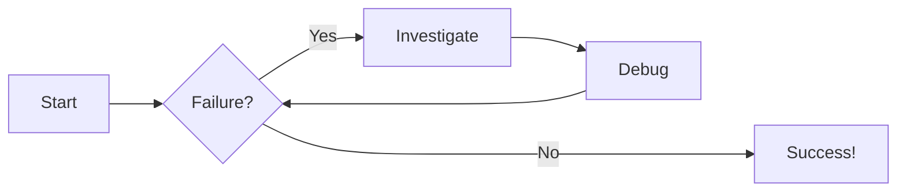
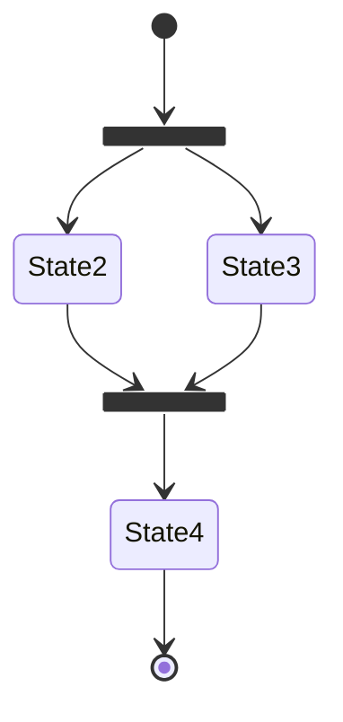

---
hide:
  - navigation
  - toc
---


# Homepage

For full documentation visit [mkdocs.org](https://www.mkdocs.org).

## Commands

* `mkdocs new [dir-name]` - Create a new project.
* `mkdocs serve` - Start the live-reloading docs server.
* `mkdocs build` - Build the documentation site.
* `mkdocs -h` - Print help message and exit.

## Project layout

    mkdocs.yml    # The configuration file.
    docs/
        index.md  # The documentation homepage.
        ...       # Other markdown pages, images and other files.

```js title="code-examples.md" linenums="1" hl_lines="2-4"
// Function to concatenate two strings
function concatenateStrings(str1, str2) {
  return str1 + str2;
}

// Example usage
const result = concatenateStrings("Hello, ", "World");
console.log("The concatenated string is:", result);
```

!!! warning "Warning"
    Attention

??? question "Question"
    Answer here.

# Diagram Examples

## Example of Mermaid

### Flow Chart



### State Diagram



=== "Tab 1"
    * 1
    * 2

=== "Tab 2"
    1. 一
    2. 二