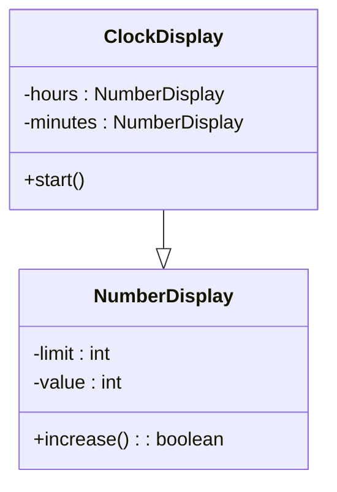

# **Class**

## **Introduction**

### **封装**

类可以实现函数和数据结构的封装，方便用户使用。

=== "C"
    在C语言中，需要单独定义数据结构和函数，略显松弛
    ```c hl_lines="1 6 7"
    typedef struct Point {
    int x;
    int y;
    } Point;

    void print(const Point* p);
    void move(Point* p, int dx, int dy);
    
    Point a;
    a.x = 1;
    a.y = 2;
    
    move(&a, 2, 2);
    print(&a);
    ```
=== "C++"
    在C++中，可以将数据结构封装在类的内部，代码整体性更强
    ```cpp hl_lines="2 6"
    class Point {
    public:
        void init(int x, int y);
        void print() const;
        void move(int dx, int dy);
    private:
        int x;
        int y;
    };

    Point a;
    a.init(1, 2);
    a.move(2, 2);
    a.print();
    ```
    用户无法直接访问或更改`private`下的数据，只能通过`public`中的方法对其进行操作

### **Objects & Class**

object由attribute（数据）和service（函数操作）组成，是class实例化后的实体。而class决定了这一类实体的性质以及能够进行的操作

### **Example：时钟显示**

假设我们需要设计一个时间显示的程序，我们固然可以分别编写显示小时和分钟的函数。但其实小时和分钟本质上都是计数器，只是进制不同而已，因此我们只要设计一个可变上限的计数器就可以了

<div align=center>



</div>

## **Class的使用**

### **声明和定义**

在C++中，class的声明和成员函数的原型（prototype）需要在`.h`文件中进行；而函数的实现（function body / implementation）在`.cpp`文件中编写。注意`.cpp`文件中include时引号和尖括号的区别

```cpp
#include "x.h" // 在当前目录中寻找
#include <x.h> // 在特定的系统文件夹中寻找，开发环境决定
```

因为重复引入头文件会导致报错，所以头文件的标准写法如下，保证了同一个头文件不会被重复include：

```cpp
#ifndef HEADER_FLAG
#define HEADER_FLAG
// declarations here...
#endif
```

头文件有一下几点需要注意：

- 一个头文件只能声明一个class
- 名字和`.cpp`文件相同
- 参照上面的标准格式

在class函数实现的过程中，如果加上`::`就表示该变量（或调用的函数）来自全局，否则表示来自class

```cpp
void S::f() {
    ::f(); // 全局的函数f，如果不加::就是递归
    ::a++; // 全局变量a
    a--;   // S内部的a
}
```

### **编译单元 Compilation Unit**

编译器每次处理一个`.cpp`文件，生成对应的`.obj`文件。所有都处理完毕后linker会将所有`.obj`文件串联为一个可执行文件。因此`.cpp`文件可以视为一个编译单元

而头文件的作用是提供不同`.cpp`文件间的信息，linker就可以知道该如何串联这些编译单元。因此头文件就相当于一个接口，是代码的作者和使用者间的一个协议（contract）。它定义了类、函数以及变量，编译时这些定义都会进入到`.cpp`文件中

### **Ctor & Dtor**

我们回顾最上面给出的class使用样例，在正常调用函数之前需要先`init`。但用户可能会忘记这个步骤，导致class中的变量并没有被赋值，这样就会导致在调用函数时这些变量是系统内存状态决定的

